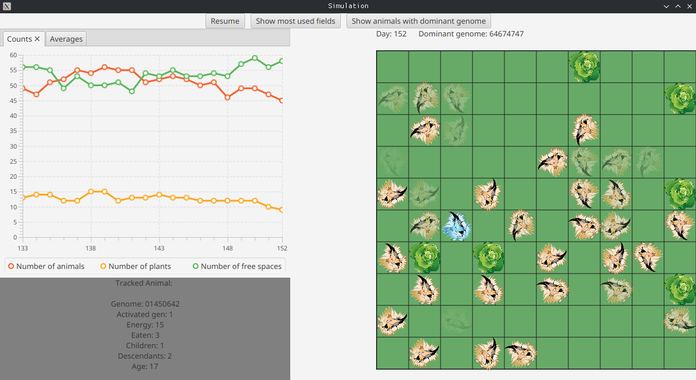
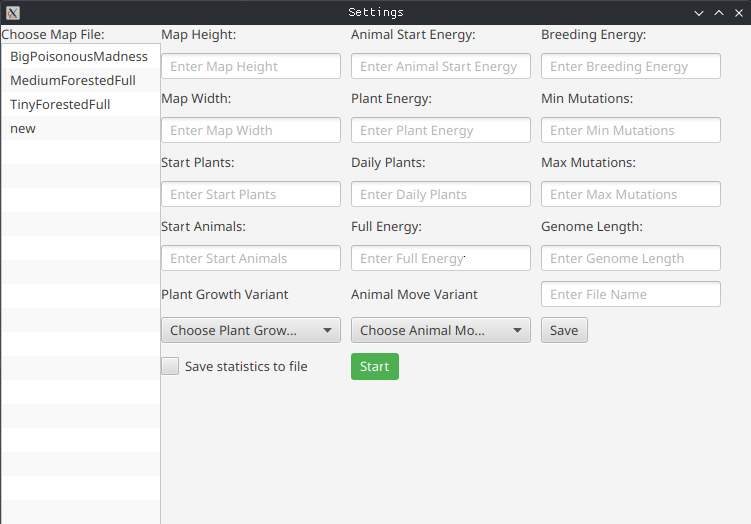

# Evolution simulator

Our evolution world is quite simple. It consists of a rectangular area divided into square cells. Most of the world is covered by steppes, where few plants grow to feed the animals. However, some areas are covered by jungle, where plants grow much faster. Plants will grow in random locations, but their concentration will be higher in the jungle than on the steppe.

Our animals, which are herbivores, will roam this world in search of food. Each animal has a certain amount of energy, which decreases every day. Finding and eating a plant increases the energy level by a certain amount.

## Animal anatomy
We need to track several features of each animal. First, for both plants and those that eat them, we need to know the coordinates x and y. They tell us where the animal or plant is on the map.

We also need to know how much energy the animal has. This is a Darwinian game of survival, so if the animal doesn't get enough food, it will starve and die... Energy tells us how many days the animal has left. It must find more food before its energy runs out.

We also need to remember which direction the animal is facing. This is important because it will move in that direction on the map every day. There are eight different possible positions and the same number of possible rotations. A rotation of 0 means that the animal does not change its orientation, a rotation of 1 means that the animal rotates by 45°, 2 by 90°, etc. For example: if the animal was facing north and the rotation is 1, the animal is now facing northeast.

Finally, we also need to store the animal's genes. Each animal has N genes, each of which is a number between 0 and 7. These genes describe (in a very simplified way) the behavioral pattern of the creature. The existence of our animals has a cyclical nature. Each of them stores information about which part of its genome it will use the next day. During each movement, the animal first changes its orientation, rotating according to the currently active gene, and then moves one cell in the designated direction. Then the gene is deactivated and the gene to the right of it is activated (it will control the animal the next day). When the genes run out, the activation goes back to the beginning of their list. For example - genome: [0 0 7 0 4] means that the animal will successively: walk straight, walk straight, walk slightly to the left, walk straight, turn around, walk straight, ... - etc.

## Consumption and Reproduction

Eating is a simple process. We assume that the animal eats the plant when it stands on its field, and its energy then increases by a predefined value.

Reproduction is usually the most interesting part of any animal simulation. Only a healthy couple of parents can have a healthy baby, so our animals will only reproduce if they have enough energy. When reproducing, the parents lose some of their energy to their young - this energy will also be the starting energy of their offspring.

The born animal receives a genotype that is a cross between the genotypes of the parents. The proportion of genes is proportional to the energy of the parents and determines the place of division of the genotype. For example, if one parent has 50 and the other 150 points of energy, the child will receive 25% of the genes of the first and 75% of the genes of the second parent. This proportion determines the place of cutting the genotype, assuming that the genes are ordered. In the first step, the side of the genotype from which the part of the stronger individual will be taken is drawn, e.g. right. In this case, the child would receive a section containing 25% left genes from the first parent and 75% right genes from the second parent. However, if the left side was drawn, the child would receive 75% left genes of the stronger individual and 25% right genes of the weaker individual. Finally, mutations take place: a random number (also randomly selected) of genes of the offspring change their values to completely new ones.

##  Simulation

The simulation of each day consists of the following sequence of steps:

1. Removing dead animals from the map.
2. Turning and moving each animal.
3. Consumption of plants on which the animals entered.
4. Reproduction of well-fed animals located in the same field.
5. Growing new plants on

## Running

JavaFX library is used for the graphical user interface.

To run the application enter project directory:
 `cd project` 
then execute on Linux:
`./gradlew run`
on Windows:
`gradlew.bat run`